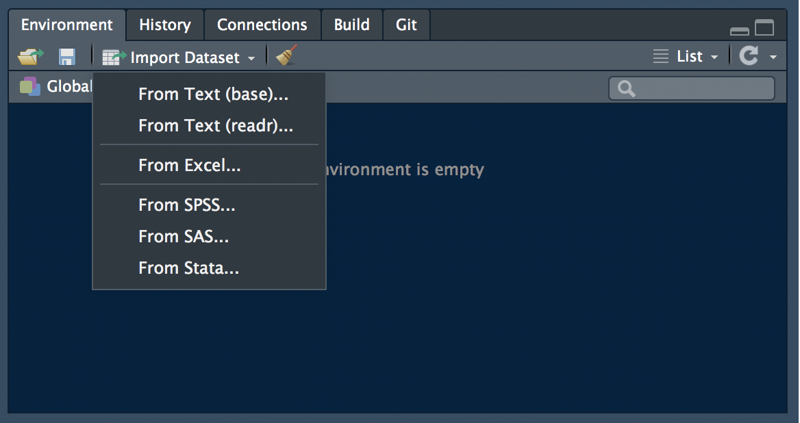

```{r setup, include = FALSE}
knitr::opts_chunk$set(
  collapse = TRUE,
  comment = "#>",
  fig.path = "img/class-1-",
  fig.align = "center"
)
```

# Goals for the class

- **Learn the basics of data import, processing, plotting, and report generation in RStudio.**

- **Reach for RStudio instead of MS Excel, Prism, etc as your go-to analysis software.** Workflows in Rmarkdown can be reproduced by you and others. Spreadsheet programs require human interaction (i.e., selecting cells, entering formulae) and are prone to mistakes.

- **Learn productive analysis habits.** Organize your data for efficient analysis and learn to explore basic properties of a data set.
 
# RStudio Overview

We'll cover the basic steps of data import and analysis within RStudio and will highlight some features of the software as we go.

**The class has its own R package, so you should begin by loading it into your session.** You may need to reinstall the package if we make updates.

```{r load_eda}
# devtools::install_github('rnabioco/eda')
library(eda)
```

## Import

There are two main ways to import data within RStudio. One is interactive, using the "Import Dataset" button in the Environment panel.


Alternatively you can use functions in the `readr` and `readxl` libraries to load data on the console or within an RMarkdown report. All of the functions have consistent `read_*` names.

```{r readr, eval = FALSE}
readr::read_tsv('XXX')
readxl::read_excel('XXX')
```

## Processing

The `tidyverse` is a collection of libraries that enable efficient data processing and visualization. You will probably start many analyses by loading the `tidyverse` library. This library loads a number of other libraries that are useful for data processing and plotting.:

```{r load}
library(tidyverse)
```

This one invocation loads several libraries including `dplyr` and `ggplot2`.

## Plotting

The `tidyverse` contains `ggplot2`, which you covered in your pre-requisites. Let's make a simple plot in RStudio. Note that the plot appears in the "Plots" panel. From there, you can Zoom, Export to a file, or Publish on RPubs.

```{r plot}
library(tidyverse)
ggplot(mtcars, aes(x = hp, y = mpg, color = factor(cyl))) + geom_point()
```

## Reports

Finally we'll create an RMarkdown document. Select File > New File > RMarkdown... and fill the Title and Author fields. Then click OK to create an RMarkdown document.

Rmarkdown is customizable with tables of contents, tabbed views and more. See the [Rmarkdown documentation](http://rmarkdown.rstudio.com/articles.html) for examples.

# Real world example: Data col in the 96-well plate format.

We'll use tidy data principles to analyze some qPCR data.

## Formatting data for efficient analysis

Reformatting your data into a "tidy" format is a useful practice that allows you efficiently manipulate and analyze data. We will start with some toy examples and then will reformat a commonly used data type from a quantitative PCR experiment.

Tidy data adopts three simple conventions:

- **columns are variables** (e.g., `cyl` and `mpg` in `mtcars`)
- **rows are observations** (e.g., Maza RX4 has 6 cyl and gets 21 mpg)

- related data should be stored in separate tables

## The `tidyr` package

The `tidyr` package has useful functions to format data for efficient analysis. See the [cheat sheet](https://www.rstudio.com/wp-content/uploads/2015/02/data-wrangling-cheatsheet.pdf) for reference.

### `gather` and `spread`

These are the workhorse functions in `tidyr`. Use `gather` when variables are in columns and you want to combine them.

```{r gather}
library(eda)
# column names in "wide" format are variables
mtcars_tbl

# gather variables and observations into `key` and `value` columns - so-called "long" format
xx <- mtcars_tbl %>% gather(key, value, -name)
xx

# and convert back to "wide" format
xx %>% spread(key, value)
```

Each form has its advantages. For example, long format makes it easy to calculate summaries:

```{r summ}
xx %>% group_by(key) %>% summarize(median(value))
```

And wide format is useful for plotting.

```{r plot_label}
library(ggrepel)
ggplot(mtcars_tbl) +
  geom_point(aes(hp, mpg, size = 5)) +
  geom_label_repel(aes(hp, mpg, fill = factor(cyl), label = name))
```

### `separate`, `extract`, and `unite`

`separate` takes a column containing multiple variables on input and returns multiple columns, each with a new variable. For example, a column with year/month/day information can be separated into invidual columns.

```{r sep_dates, echo = FALSE}
ys <- 1999:2002
ms <- c('Jan', 'Feb', 'Mar')
ds <- 1:10

dates <- tidyr::crossing(ys, ms, ds) %>% unite(date, ys:ds, sep = '-')
```

```{r sep_dates2}
dates

dates %>% separate(date, into = c('year', 'month', 'day'), sep = '-')
```

The `sep` argument can take:

- a character (split `rep_value` using `sep = '_'`)

- a position (split `a1` using `sep = 1` into `a` and `1`)

Finally the `extra` and `fill` arguments control what happens when there are too many and not enough variables.

### `crossing` and `complete`

`crossing` is useful to generate combinations of variables. For example, use `crossing` to generate combinations of experimental varaibles including sample names, gene names, reaction conditions, and replicates.

```{r crossing}
sample <- c('wt', 'mut')
gene <- c('IFN', 'ACTIN')
time <- c(0, 12, 24, 48)
rt <- c('+', '-') # reverse transcriptase added?
rep <- 1:3

tidyr::crossing(sample, gene, time, rep, rt)
```

## Naming samples.

All variables should be systematically listed in your sample names, i.e. `name_rep_time_RT`. Systematic naming makes it easy to programmtically extract relevant information.

Take an example like this, where the sample names are a combination of a genotype (`WT` and `MT`), a time point (0,4,8,24 hour), and a replicate (1,2,3), separated by a hyphen.

```{r sample.names, echo=FALSE}
library(tidyverse)
library(stringr)

# for reproducible `sample`
set.seed(47681)

samples <-
  tidyr::crossing(
    name = c('WT', 'MT'),
    hours = c('t0', 't4', 't8', 't24'),
    reps = 1:3) %>%
  mutate(
    value = sample(1:100, n(), replace = TRUE),
    .id = row_number()) %>%
  unite('sample.name', name, hours, reps, sep = '-') %>%
  select(-.id)

samples
```

Because the samples are named systematically, it is easy to separate this information into individual columns

```{r extract_info}
sample_info <- samples %>%
  tidyr::separate(
    sample.name,
    into = c('sample', 'hour', 'rep'),
    sep = "-"
  )
```

Now we can use `dplyr` and `tidyr` functions to manipulate the data.

```{r manip}
sample_info %>% group_by(sample, hour) %>% summarize(mean(value))

sample_info %>% spread(hour, value) %>% mutate(t24_norm = t24 - t0)
```

## Organizing samples.

How should you organize samples on your plate? Should -RT and +RT samples alternate? Where should I put my "no template" controls?


```{r}
library(eda)

qpcr
```

<!-- From Rachel: Basically, I calculate the average Ct between all the sample replicates for the gene of interest primer set and the internal control. Then you subtract the gene of interest average from the internal control average and use that change in CT to calculate the fold change relative to actin using the deal-delta CT method. -->

```{r}
qpcr_tidy <- qpcr %>%
  separate(sample, into = c('ligand', 'RT'), sep = '_', fill = 'right') %>%
  select(-fluor, -content, -well) %>%
  mutate(RT = is.na(RT))
```

# Exercises

1. 

2.  

3. 

4.

# Too Easy?

If you found those exercises too easy, try these:

1. Tidy the `anscombe` data set. Your tidy data should look like:

```{r anscombe, echo=FALSE}
anscombe_tidy <- anscombe %>%
  mutate(.id = row_number()) %>%
  gather(key, value, -.id) %>%
  separate(key, into = c('var', 'set'), sep = 1) %>%
  spread(var, value) %>%
  select(-.id) %>%
  arrange(set, x) %>%
  as_tibble()

anscombe_tidy
```


2. Calculate summary statistics in your tidy `anscombe` data. Calculate `n`, `mean`, and `var` for each `x` and `y` variable in the sets.  Try using `summarize_each` for this calculation.

Calculate the `cor` between `x` and `y` for each set. What do you infer from these summary statistics?

3. Plot the tidy `anscombe` data. Plot each `x`/`y` point on separate facets for each set, and plot a smoothing line. Examine the plots. How do they compare to the summary statistics?

```{r, eval = FALSE, show = FALSE}
ggplot(anscombe_tidy, aes(x, y)) +
  geom_point() +
  facet_wrap(~set) +
  geom_smooth(method = 'lm', se = FALSE)
```

# Quiz

Create an RMarkdown document and answer the questions from the Exercises section. Submit your final document as "Quiz 1" by Thurs at 10 PM.

**Your submitted document must knit to HTML without errors**. I.e., when you click the "Knit" button, the document should build and display and HTML page.

# Resources

- This [slide deck](https://speakerdeck.com/jennybc/how-to-name-files) from Jenny Bryan has useful tips for naming files that are also applicable to sample names.
