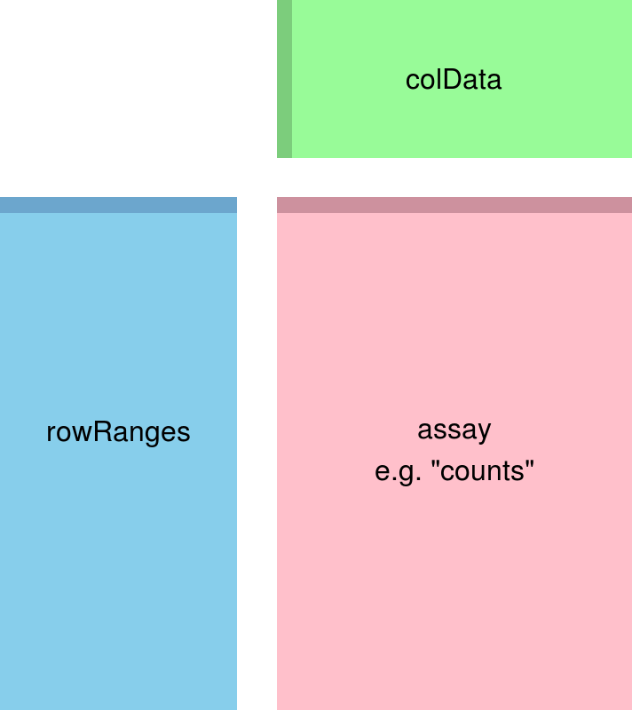

```{r setup, include=FALSE}
knitr::opts_chunk$set(
  collapse = TRUE,
  comment = "#>",
  fig.align = "center"
)

library(DESeq2)
library(ComplexHeatmap)
library(RColorBrewer)
library(tidyverse)
library(cowplot)
library(pbda)
```

# RNA-seq analysis in R

- Introduce matrices and matrix manipulation in R
- Build a DESeqDataSet and calculate differential gene expression
- Plot results and QC metrics

## Matrices in R are two dimensional objects that contain elements of one atomic type
 
Matrices can contain characters or logical values, but we're really only interested in numeric matrices:

```{r, matrix_intro, eval = T}
# Build 4x3 matrix with row-wise series of integers
M <- matrix(1:12,
            nrow = 4,
            byrow = TRUE)

M
```

## Elements of a matrix can be accessed using column and row indices or names

To return the value in the first row, second column:

```{r, matrix_index, eval = T}
M[1,2]
```

With named rows and columns:

```{r, matrix_names, eval = T}
# Assign column names
colnames(M) <- c("col1",
            "col2",
            "col3")

# Assign row names
row.names(M) <- c("row1",
            "row2",
            "row3",
            "row4")

M["row1","col2"]
```
Index ranges and character vectors of row/column names also work:

```{r, eval = T}
M[1:2,2:3]

M[c("row1","row2"),c("col2","col3")]
```

As does negative selection:

```{r, eval = T}
# Exclude rows 1 and 4
M[-c(1,4),]
```

Full rows and columns can be extracted as well:

```{r, matrix_vector, eval = T}
# print 1st row
M[1,]

# print 2nd column
M[,2]

# print 2nd and 3rd rows
M[2:3,]
```

## Mathematical operations can be performed on numeric matrices

For example, taking the base 2 logarithm of each value:

```{r, matrix_log, eval = T}
M_log <- log2(M)

M_log
```

Or normalizing all columns relative to an arbitrary reference column:

```{r, matrix_norm, eval = T}
M_norm <- M/M[,1]

M_norm
```

### Matrix Exercises

 - Build a 100x100 row-wise matrix of sequential integers named `mat`.
 - Create a new matrix, `mat_sub`, with columns 2-10 and rows 40-60 from the `mat`.
 - Calculate the maximum and minimum values present in `mat_sub`.
 - Using the `rowMeans()` function, subtract the row-wise mean from each value in `mat_sub`.
 
# Analyzing RNA-Seq Data

## Simplified RNA sequencing analysis workflow (genome alignment)

Step | Tools | Description
--------------------------- | -------------------- | --------------------------------------------
Align reads to genome | STAR, HISAT2 | Align reads to genomic sequence, retaining strand information if present
Assign reads to features | Subread, StringTie | Assign aligned reads to genes and/or transcripts
Calculate differential expression | DESeq2, edgeR, Ballgown | Fit count matrices to model to determine differential expression

## Simplified RNA sequencing analysis workflow (quasi-mapping)

Step | Tools | Description
--------------------------- | -------------------- | --------------------------------------------
Estimate transcript abundance | Salmon / Kallisto | Estimate transcript abundance directly on transcriptome sequences
Calculate differential expression | DESeq2, edgeR, Ballgown | Fit count matrices to model to determine differential expression

## Inspect RNA-seq count and phenotype data from file that is included in pbda package

```{r, pkg_data, message = F}
# View first few rows of count matrix
head(drug_resistant_counts)

# View phenotype data
drug_resistant_coldata
```

## DESeq2 uses DESeqDataSets, a subset of the Bioconductor SummarizedExperiment object, to store data

SummarizedExperiment objects provide a structured, self-contained way to store phenotype, gene and assay data, along with analysis intermediates and parameters.

```{r}

```

## Build a DESeqDataSet from the drug_resistant data and inspect the object

```{r colnames1, message=FALSE}
# Create DESeqDataSet from drug_resistant data
dds <- DESeqDataSetFromMatrix(countData = drug_resistant_counts,
                                         colData = drug_resistant_coldata,
                                         design = ~drug)
# View DESeqDataSet
dds

# View design
dds@design

# View colData
colData(dds)

# View counts
assay(dds) %>% head()
```

## Filter genes with little or no expression

DESeq2 performs internal filtering to remove genes with low expression, but explicitly filtering extreme cases beforehand can speed up processing.

```{r colnames2}
# number of genes before filtering
nrow(dds)

# remove genes with 0-1 total reads
dds <- dds[rowSums(counts(dds)) > 1,]

# number of genes after filtering
nrow(dds)
```

### Count matrix manipulation exercises

 - Print the counts for the genes ESR1, TFF1 and PGR from the count matrix in dds.
 - Filter genes with fewer than 5 counts in at least 3 samples.

## Stabilize the variance across the mean for visualizing count data

Many analysis methods for multidimensional data rely on variance being consistent across mean values. Raw count data has the greatest variance at high mean values (largest raw values), while log2-transformed data has the greatest variance at low mean values (largest fold-changes). To get around this, DESeq2 provides two different functions - `vst()` and `rlog()` - that stabilize variance across the mean.

```{r}
# rlog transform
rld <- rlog(dds,
            blind = FALSE)
```

## Sample distances are useful to assess the overall similarity between samples

Sample distance plots are used to assess overall similarity between samples: which samples are similar to each other, which are different? We calculate the euclidean distance between samples using `dist()` on the rlog-transformed data to ensure roughly equal contributions from all genes.

```{r fig.height=5, fig.width=6}
# Transpose count matrix and calculate distances using dist()
sampleDists <- assay(rld) %>% t() %>% dist()

# Convert distance dataframe to matrix
sampleDistMatrix <- as.matrix(sampleDists)

# Choose continuous palette from RColorBrewer
colors <- colorRampPalette(rev(brewer.pal(9, "Blues")))(255)

# Plot sample distance heatmap with ComplexHeatmap
Heatmap(sampleDistMatrix, cluster_rows = F, cluster_columns = F,
         col = colors)
```

## Principle Component Analysis (PCA) plots

Another method for visualizing relationships in multidimensional data is principle component analysis. PCA identifies clusters of variables (in this case, genes) that explain the majority of the variance present. PCA plots are x-y plots of the first two principle components; they spread the samples out in the two directions that explain most of the differences.

``` {r pca, fig.height=5, fig.width=6}
# Generate PCA plot with DESeq2 plotPCA() wrapper
plotPCA(rld, intgroup = "drug") +
  scale_color_brewer(palette = "Set1")
```

## Calculating differential expression

DESeq2 provides a wrapper function `DESeq()` that takes a DESeqDataSet and calculates differential expression. Progress through analysis steps are printed as the function runs.

``` {r fig.height=5, fig.width=6}
# Run DESeq2
dds <- DESeq(dds)
```

## Extracting results after differential expression is calculated

DESeq2 results are extracted with the `results()` function.

``` {r fig.height=5, fig.width=6}
# Extract default results (No Drug vs. Drug A)
res <- results(dds)

# View results summary
summary(res)

# Convert dataframe to tibble for use with tidyverse tools
res_tibble <- as_tibble(res, rownames = "gene")
```

## MA-plots

MA plots - plots of mean expression (x-axis) vs. log2-fold change (y-axis) - are useful for visualizing the distribution of gene expression in your comparisons.

``` {r fig.height=5, fig.width=6}

# Plot MA without moderating log2 fold-changes
plotMA(res, ylim = c(-6,6))

# Return results with moderated log2 fold-changes.
res_ma <- lfcShrink(dds, contrast=c("drug","none","A"), res=res, type='normal')

# Plot MA
plotMA(res_ma, ylim = c(-6,6))

```

## Plotting differential expression results

DESeq2 can plot normalized counts using the `plotCounts()` function.

``` {r fig.height=5, fig.width=6}
# Plot differential expression
plotCounts(dds,
           gene = "ESR1",
           intgroup=c("drug"))

# Clean up plot with ggplot2
dds_plot <- plotCounts(dds,
           gene = "ESR1",
           intgroup=c("drug"),
           returnData = TRUE)

ggplot(dds_plot, aes(x = drug, y = count, color = drug)) +
  scale_y_log10() +
  geom_point(cex = 3)
```

## Plotting heatmaps of differentially expressed genes

The ComplexHeatmap package can be used to plot differential gene expression across samples/replicates.

``` {r fig.height=5, fig.width=6}
# extract the 20 most significantly differentially expressed genes
top_genes <- res_tibble %>% arrange(padj) %>% head(20)

# subset rlog matrix based on gene list
mat  <- assay(rld)[ top_genes$gene, ]

# normalize expression to per-gene average
mat  <- mat - rowMeans(mat)

# plot heatmap
Heatmap(mat)
```